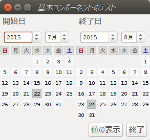
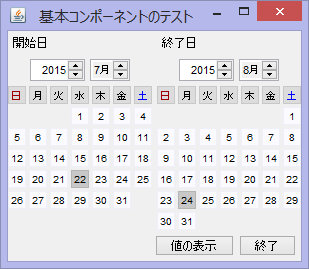

## (Java) Swing用カレンダー コントロール<br />Calendar Control for Swing Library<!-- omit in toc -->

---
[Home](https://oasis3855.github.io/webpage/) > [Software](https://oasis3855.github.io/webpage/software/index.html) > [Software Download](https://oasis3855.github.io/webpage/software/software-download.html) > [java-swingcalendar](../java-swingcalendar/README.md) > ***java-swingcalendar*** (this page)

<br />
<br />

Last Updated : May. 2015

- [ソフトウエアのダウンロード](#ソフトウエアのダウンロード)
- [機能の概要](#機能の概要)
- [使用方法](#使用方法)
- [バージョンアップ情報](#バージョンアップ情報)
- [ライセンス](#ライセンス)


<br />
<br />

## ソフトウエアのダウンロード

-    [このGitHubリポジトリを参照する](../java-swingcalendar/) 

<br />
<br />

## 機能の概要

SWTに存在するカレンダー ヴィジェットがSwingには標準機能として存在しないため、暫定的に作ったカレンダー コントロール。


<br/>Linux Gnomeシェル(Ubuntu 14.04LTS)での表示 


<br/>Windows 8.1での表示

<br />
<br />

## 使用方法

```Java
JFrame frame = new JFrame();
 
frame.setDefaultCloseOperation(JFrame.EXIT_ON_CLOSE);
 
// 親コンテナ
Container container = frame.getContentPane();
container.setLayout(new BoxLayout(container, BoxLayout.Y_AXIS));
frame.setContentPane(container);
// 上部パネル（日付コントロール配置）
JPanel panel1 = new JPanel(new GridLayout(1, 2, 5, 5));
SwingCalendar calendar1 = new SwingCalendar(2015, 7, 22, "開始日");
panel.add(calendar1);
container.add(panel1);
// 下部パネル（ボタン配置）
JPanel panel2 = new JPanel(new FlowLayout(FlowLayout.RIGHT));
JButton button = new JButton("値の表示");
panel2.add(button);
container.add(panel2);
// 「値の表示」ボタンの動作設定
button.addActionListener(new ActionListener() {
    @Override
    public void actionPerformed(ActionEvent e) {
        // ボタンが押されたら、選択された日付をメッセージダイアログに表示
        JOptionPane.showMessageDialog(
                frame,
                "開始年月日： " + calendar1.getYear() + "/"
                        + calendar1.getMonth() + "/"
                        + calendar1.getDay());
    }
});
// メイン ダイアログの表示
frame.pack();
frame.setVisible(true);
```

<br />
<br />

## バージョンアップ情報

- Branch from http://pastebin.com/TvdWJsWu
- Version 1.1 (2015/05/06)

  - 改変版 当初 
  - 選択日付を「当日のみ」から「任意の年月日」に変更 
  - 選択された年月日を読み出すメソッドの追加 
  - ダイアログ上で年月日を選択するコントロールにマッチする表示サイズに縮小 

<br />
<br />

## ライセンス

Branch元のソフトウエアが著作権表記をしていない、「著作権放棄ソフトウエア」と推測されるため、私も著作権を放棄します。


